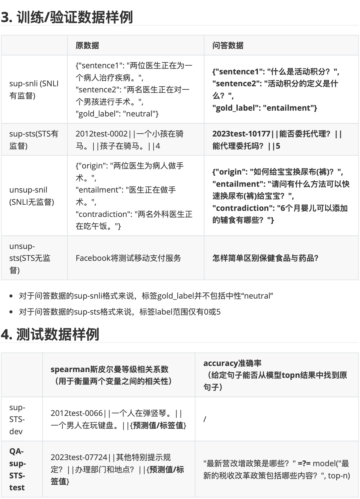
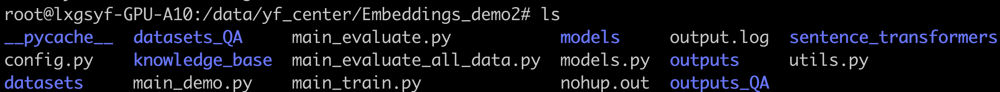

# 对比学习项目

## 1. 项目介绍

- 使用对比学习的方法，对比四种模型：SBert，SIMcse，ESIMcse，ConSERT

- 使用的评判标准：cosine_spearman系数
- 使用的数据：中文的STS和SNLI的有/无监督数据，以及政策的问答数据
- 详情见报告《对比学习项目\_ver01.pdf》和《对比学习项目\_ver02.pdf》
- 项目在XXX.XXX.XXX.XXX服务器上

## 2. 项目数据

## 3. 项目架构

- 文件夹models：
    - 文件夹chinese-bert-wwm-ext：BERT模型
    - 文件夹chinese-macbert-base：MacBERT模型
    - 文件夹chinese-roberta-wwm-ext：RoBERTa模型
    - 文件夹rbt6：rbt6模型
- 文件夹sentence_transformers：
    - 文件夹cross_encoder：定义cross_encoder（一对文本作为输入，输出为score或label）
    - 文件夹datasets：定义datasets和dataloader类
    - 文件夹evaluation：计算和储存各种评测结果，如euclidean_accuracy
    - 文件夹losses：定义各种输入的损失函数
    - 文件夹models：对于torch中各层进行封装，如WordEmbeddings层
    - 文件夹readers：处理这种数据格式的reader，如STSDataReader
    - 代码\_\_init\_\_.py：定义初始化函数，使得python将sentence_transformers作为一个包
    - 代码ConSERT.py：ConSERT模型
    - 代码ESimCSE.py：ESimCSE模型
    - 代码LoggingHandler.py：定义logging处理方法
    - 代码model_card_templates.py：定义model card
    - 代码SentenceTransformer.py：加载或创建句向量模型
    - 代码util.py：定义一些辅助函数，如计算cos_sim余弦相似度
- 文件夹datasets：
    - 文件夹MNLI：MNLI格式的数据
    - 文件夹SNLI：SNLI格式的数据
    - 文件夹STS-B：STS-B格式的数据
- 文件夹datasets_QA：业务数据处理后的各种SNLI，STS的有监督和无监督数据
- 文件夹knowledge_base：
    - 文件夹csv：包括各个sts和snli数据和类似格式的问题业务数据，及相关评测结果
    - 文件夹qa：包括问题业务数据和Faiss库
    - 文件夹txt：包括问题业务数据和Faiss库
- 文件夹outputs：存储各个模型
- 文件夹outputs_QA：存储各个模型（使用业务问答数据训练）

- 代码config.py：包括模型/数据路径，训练参数，模型保存路径
- 代码main_demo.py：提供训练模型，faiss search的样例
- 代码main_evaluate_all_data.py：使用accuracy评测各模型
- 代码main_evaluate.py：从outputs文件夹中读取模型，评测dev和test数据表现
- 代码main_train.py：调用models.py及定义logging
- 代码models.py：定义主要的模型train方法，模型保存至outputs(_qa)文件夹
- 代码utils.py：读取各种有监督无监督的SNLI和STS数据

- 其他nohup.out：nohup运行的output文件
- 其他output.log：log文件
- 其他requirements.txt：python需依赖的包

## 4. 注意事项

- NLP-Series-sentence-embeddings：https://github.com/zhoujx4/NLP-Series-sentence-embeddings